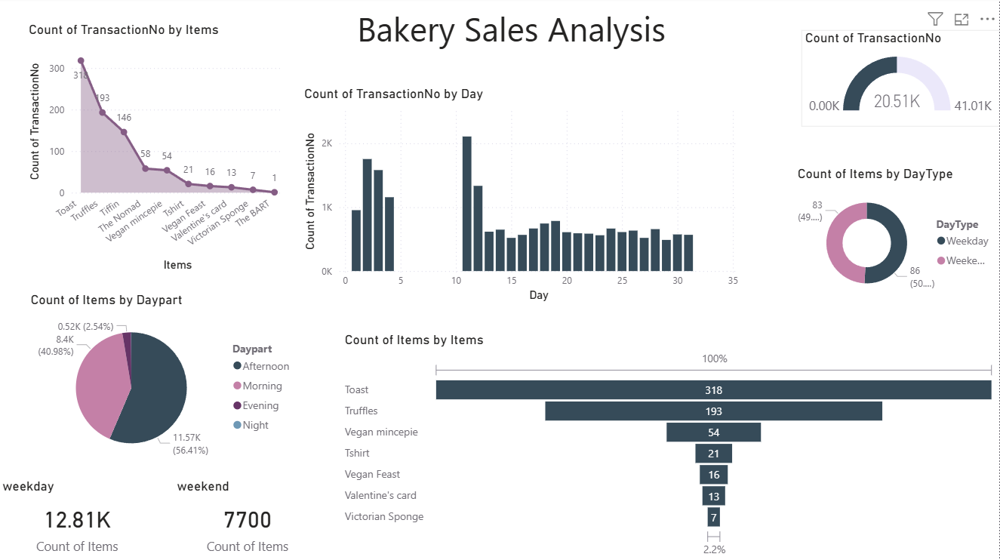

# Predictive Analysis of Bakery Sales Data

## Overview

This project analyzes bakery sales transactions across multiple dimensions, including product category, month, year, day type, and time of day. The objective is to identify customer purchasing patterns, evaluate sales performance, and generate actionable business recommendations to improve operational efficiency and revenue growth.

---

## Tools & Technologies

- Power BI
- DAX
- Data Modeling
- Data Visualization
- Sales Analytics

---

## Business Problem

Understanding customer purchasing behavior is critical for optimizing inventory, staffing, product offerings, and customer retention strategies. This dashboard provides insights into sales trends and operational opportunities using transaction data from 2016–2017.

---

## Dashboard Highlights

- Overall Sales Performance Analysis
- Sales Trend by Year
- Sales Analysis by Time of Day
- Weekday vs Weekend Sales Comparison
- Product Category Performance Analysis
- Top-Selling Product Insights
- Monthly Sales Trend Analysis
- Customer Purchasing Pattern Analysis
- Interactive KPI Monitoring

---

## Dashboard Preview

### Bakery Sales Analysis

## Key Findings

### Time-Based Sales Patterns
Morning and evening periods generate the highest sales volumes, making them the bakery's most important revenue-generating time slots.

### Mid-Day Demand Decline
Transaction activity consistently declines between 12 PM and 3 PM, indicating opportunities for operational optimization during lower-demand periods.

### Yearly Sales Growth
Sales performance improved significantly in 2017 compared to 2016, demonstrating positive business growth.

### Product Performance
Hot Chocolate emerged as the best-performing product, reflecting changing customer preferences and seasonal demand patterns.

### Weekday vs Weekend Sales
Weekday sales substantially exceed weekend sales, highlighting a strong commuter-driven customer base and predictable purchasing behavior.

### Core Revenue Drivers
Coffee, Bread, and Tea collectively account for more than 70% of total sales volume and remain the bakery's primary revenue-generating products.

---

## Recommendations

### 1. Time-Based Menu Optimization
Introduce targeted menu offerings during peak morning and evening periods to maximize revenue opportunities and improve customer experience.

### 2. Operational Resource Optimization
Adjust staffing schedules during lower-demand periods and allocate resources toward inventory management, preparation, and quality control activities.

### 3. Seasonal Product Rotation
Implement seasonal product rotations to align offerings with customer preferences and encourage repeat purchases.

### 4. Customer Loyalty Programs
Develop loyalty programs and personalized promotions to strengthen customer retention and increase repeat business.

---

## Business Impact

This project demonstrates how sales analytics can be used to:

- Identify customer purchasing patterns
- Optimize staffing and operational planning
- Improve inventory management
- Support product strategy decisions
- Enhance customer retention initiatives
- Increase revenue through data-driven insights

---

## Dataset

Bakery Sales Transactions Dataset (2016–2017)

---

---

## Author

Steffi Angel

Power BI | Data Analytics | Business Intelligence
